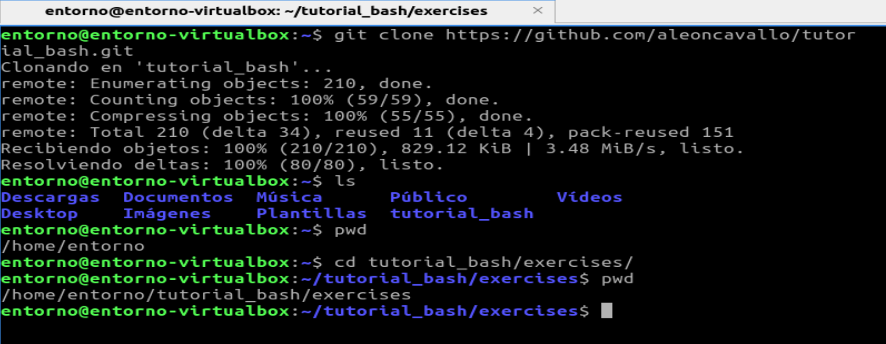

La Línea de Comandos Bash
==========================


Este tutorial te familiariza con **bash**, el intérprete de comandos más popular de Linux. Aprenderás a:

* navegar por directorios
* manipular archivos
* ejecutar programas / scripts
* descomprimir / comprimir archivos

Si no tienes experiencia previa con sistemas tipo Unix o conoces algunos comandos pero te gustaría aprender más, este tutorial es para ti.

### Requisitos previos

*Este tutorial se preparó para Ubuntu Linux, pero también funciona en MacOS,
Cygwin y Git bash, siempre que Python 3 esté instalado en
tu sistema.*

----

## Objetivo

En este tutorial, buscarás una palabra con 22 caracteres:


Todos los caracteres están ocultos en los ejercicios que se presentan a continuación.

## Preparativos

* abre un emulador de terminal de `bash` 
* clona el respositorio con 
``` {.sourceCode .bash}
git clone https://github.com/aleoncavallo/tutorial_bash.git
```
puedes copiar el texto haciendo click en el icono que aparece a la derecha del comando al acercar el puntero
puedes pegar lo copiado usando `[Ctrl]` + `[Shift]` + `[v]` (`[Ctrl]` +  `[v]` no va a funcionar )
Esto tendrá el efecto de copiar los archivos de este desafío en la carpeta tutorial_bash, donde estés en la jerarquía de archivos.

* Luego ingresa a la carpeta `exercises/`
``` {.sourceCode .bash}
cd tutorial_bash/exercises
```



----

## 1. Directorios y archivos


### 1.1. Navegación de directorios

El **primer caracter** está oculto en un archivo en algún lugar del árbol de directorios del directorio *exercise_1*. 

Con el comando *P*rint *W*orking *D*irectory, se puede averiguar dónde estas en la jerarquía de archivos
``` {.sourceCode .bash}
pwd
```

Usando el comandos *ls* se puede listar el contenido de un directorio.

Con *Li*s*t Directory podemos ver el contenido del directorio donde se encuentra la shell:
``` {.sourceCode .bash}
ls
```

Usa *C*hange *D*irectory para cambiar de directorio

``` {.sourceCode .bash}
cd <nombre_directorio>
```
(no escribas los corchetes angulares, en su lugar inserta el nombre del directorio de destino) 

Deberas buscar en los directorios hasta que encuentres uno con el nombre `solution_1.1` y ahí listar su contenido.

Si te equivocaste de directorio, puedes subir un nivel escribiendo:

``` {.sourceCode .bash}
cd ..
```

o volver a tu carpeta de inicio:

``` {.sourceCode .bash}
cd ~
```
(que incluso se puede hacer obviando el ~)


### 1.2. Mostrar un archivo oculto

Algunos archivos no son visibles de inmediato. Para verlos, necesitaras usar el comando:

``` {.sourceCode .bash}
ls -a
```

El **segundo caracter** está en el mismo directorio que el primero, pero en un archivo oculto.

### 1.3. Ejecutar un programa

Usa `cd ..` para volver al directorio `exercise_1/directoryB/`. Cuando
muestres su contenido, deberías ver un **archivo de script de shell**
llamado `program.sh`. Para encontrar el **tercer caracter**, necesitas ejecutar
el programa. En bash, esto se hace escribiendo source y el nombre del
programa:

``` {.sourceCode .bash}
source program.sh
```

### 1.4. Descubrir el tamaño de un archivo

Ve a la carpeta `exercise_1/directoryC/`. Para encontrar el **cuarto
caracter**, necesitas averiguar cuánto mide el archivo de texto en el directorio.
Esto se hace con el comando

``` {.sourceCode .bash}
ls -l
```

En la tabla que produce el comando, encontrarás el tamaño del archivo en bytes,
el propietario del archivo, los permisos de lectura y modificación, y la fecha/hora
de la última modificación.

Para obtener el cuarto caracter, busca el tamaño del archivo en la [Tabla de
caracteres ASCII imprimibles](https://en.wikipedia.org/wiki/ASCII#Printable_characters):


*ASCII Table, Dominio Público*

<div class="admonition hint">

Cuando escribas nombres de directorios, archivos o comandos, presiona `[TAB]` después de los primeros
caracteres. Bash intentará adivinar lo que estás escribiendo.
</div>

----

## 2. Editar archivos de texto

Por favor, usa `cd ..` para regresar al directorio principal del material del tutorial.
Luego, cambia al directorio `exercise_2`.

### 2.1. Ver qué hay en un archivo de texto

En el directorio *exercise_2/* encontrarás un archivo de texto llamado
*solution_2.1.txt*. El **quinto carácter** se encuentra dentro de ese archivo. Para ver
su contenido, usa el comando

``` {.sourceCode .bash}
less <nombre_archivo>
```

Para salir del programa less presiona la tecla 'q'.

### 2.2. Editar archivos de texto

Para obtener el **sexto carácter**, necesitarás crear un archivo de texto en
el directorio `exercise_2`. En Ubuntu, puedes hacer esto usando el editor
`nano`. Puedes iniciarlo escribiendo el nombre del programa o

``` {.sourceCode .bash}
nano <nombre_de_archivo>
```

**Para salir de nano, presiona Ctrl-X**

Crea un archivo de texto con los caracteres que has encontrado hasta ahora.

El **sexto carácter** es el que debes presionar para guardar un archivo en
`nano`.

<div class="admonition hint">

Si quieres obtener más información sobre un comando en particular, escribe

``` {.sourceCode .bash}
man <comando>
```

Se mostrará una página de ayuda que puedes cerrar presionando 'q'.

</div>

----

## 3. Copiar y eliminar archivos

Por favor, ve al directorio `exercise_3`.

### 3.1. Crear un directorio y copiar un archivo en él

Para encontrar los **caracteres siete y ocho**, debes crear un
subdirectorio llamado *solution* en `exercise_3/` y copiar los archivos de
las carpetas `part1/` y `part2/` dentro de él.

Para crear directorios, usa el comando:

``` {.sourceCode .bash}
mkdir <nombre_directorio>
```

Para copiar, puedes usar el comando

``` {.sourceCode .bash}
cp <nombre_archivo_origen> <nombre_archivo_destino>
```

Después, escribe `ls -l solution/*` para ver la solución.

### 3.2. Eliminar archivos

En el directorio `data`, todos los archivos que contienen una `Y` en el nombre deben ser eliminados. Para hacerlo,
usa el comando:

``` {.sourceCode .bash}
rm <nombre_archivo>
```

Además, hay más archivos que deben ser eliminados en el directorio *data*. Para
eliminar más de un archivo a la vez, puedes usar `*` como comodín, es decir,
`rm ju*` eliminará todos los archivos `junk.txt, juniper.txt` y `june.docx`.

Para obtener los **caracteres nueve y diez**, observa los archivos que quedan después de
eliminar todos los que contienen una `Y`.

<div class="admonition hint">

Para eliminar un directorio vacío, puedes usar

``` {.sourceCode .bash}
rmdir <nombre_directorio>
```

El comando

``` {.sourceCode .bash}
rm -r <nombre_directorio>
```

elimina un directorio y todo lo que hay en el mismo.

</div>

<div class="admonition warning">
  
En el shell de linux, no se guarda por defecto una papelera para recuperar archivos borrados.

Esto hace que eliminar archivos utilizando el símbolo `*` sea **muy** peligroso, ya que podrías eliminar todo con un solo comando 
(por ejemplo, si escribes el directorio equivocado por accidente). 
Hacer copias de seguridad se vuelve aún más importante después de aprender este comando.
  
</div>

----## 4. Procesar datos de texto

Por favor, ve al directorio `exercise_4`.

### 4.1. Comparar dos archivos

Existen dos versiones diferentes de una cita: `ai.txt` y `artificial_intelligence.txt`. Para saber cómo difieren entre sí, Unix proporciona el comando:

``` {.sourceCode .bash}
diff <nombre_de_archivo1> <nombre_de_archivo2>
```

Por supuesto, puedes ver el texto primero usando `less` o `nano`. El **11º carácter** de la solución es el único carácter en el que los dos archivos difieren.

### 4.2. Ordenar un archivo de texto

Unix tiene un pequeño programa para ordenar archivos de texto alfabéticamente. Se llama de la siguiente manera:

``` {.sourceCode .bash}
less <nombre de archivo> | sort
```

El símbolo '|' se llama tubería y se utiliza frecuentemente para conectar programas de Unix entre sí. El **12º carácter** de la solución es el primer carácter de la última palabra en el archivo `elephant.txt` ordenado alfabéticamente.

<div class="admonition hint">

Para guardar las líneas ordenadas en un nuevo archivo, puedes agregar un archivo de salida, de la siguiente manera:

``` {.sourceCode .bash}
less <nombre de archivo> | sort > resultado.txt
```

</div>

### 4.3. Encontrar palabras en un archivo de texto

Para buscar palabras específicas en un archivo de texto, utiliza el comando

``` {.sourceCode .bash}
grep <palabra> <nombre_de_archivo>
```

Este comando mostrará todas las líneas del archivo dado que contengan la palabra especificada. El comando `grep` es muy poderoso y puede manejar Expresiones Regulares.

Para encontrar el **13º carácter**, busca la palabra **fire** en el archivo `datascience.txt` y toma el **primer** carácter del resultado.

<div class="admonition hint">

Puedes buscar en varios archivos a la vez incluyendo un asterisco (\*) en el nombre del archivo.

</div>

<div class="admonition warning">

Los dos últimos ejercicios pueden no funcionar en Git Bash.

</div>
  

----

## 5. Descomprimir archivos

Por favor, ve al directorio `exercise_5`.

### 5.1. Descomprimir archivos

Descomprimir archivos comprimidos es una tarea básica e importante. En Unix, a menudo te encontrarás con archivos comprimidos de WinZip, archivos .tar y archivos comprimidos .gz. Para desempaquetar archivos de WinZip, utiliza el comando

``` {.sourceCode .bash}
unzip <nombre de archivo>
```

para archivos .tar y .tar.gz

``` {.sourceCode .bash}
tar -xf <nombre de archivo>
```

y para archivos .gz,

``` {.sourceCode .bash}
gunzip <nombre de archivo>
```

El **14º y 15º carácter** de la solución se encuentran en un archivo comprimido múltiple en el directorio `exercise_5`.

<div class="admonition hint">

Para empaquetar un directorio y todo lo que contiene, puedes utilizar el siguiente comando

``` {.sourceCode .bash}
tar -cf backup.tar <directorio>
```

Para comprimirlo posteriormente, utiliza

``` {.sourceCode .bash}
gzip backup.tar
```

</div>

----

## 6. Herramientas de línea de comandos

Por favor, ve al directorio `exercise_6`.

### 6.1. Cambiar los permisos de acceso a un archivo

Cada archivo en Unix tiene permisos separados para leer ('r'), escribir ('w') y ejecutar ('x'). Para mostrarlos, utiliza el comando:

``` {.sourceCode .bash}
ls -l
```

Hay un conjunto de permisos para el propietario del archivo, uno para un grupo de usuarios y otro para todos los demás. El comando `chmod` permite cambiar estos permisos, por ejemplo:

``` {.sourceCode .bash}
chmod a+x <nombre de archivo>
```

concede a todos los usuarios el permiso de ejecutar un archivo, mientras que `chmod u-w` prohíbe al usuario actual (uno mismo) escribir en el archivo (protegiéndolo así de ser eliminado accidentalmente).

Para ver los **caracteres 16+17** de la solución, haz que el programa `permissions.sh` sea ejecutable. Luego ejecútalo con:

``` {.sourceCode .bash}
./permissions.sh
```

<div class="admonition hint">

Puedes otorgar permisos para todo un árbol de directorios utilizando la opcion -R de recursive:

``` {.sourceCode .bash}
chmod -R a+x <directorio>
```

</div>

### 6.2. ¿Cuánto espacio en disco me queda?

Para saber cuánto espacio en disco te queda, puedes utilizar el comando

``` {.sourceCode .bash}
df
```

`df` lista todas las particiones de disco duro, CD-ROM, pendrives y algunas particiones lógicas que Unix utiliza. Todos los números se dan en kilobytes (1000 bytes o una millonésima de GB).

Para obtener el **18º carácter**, verifica la versión del programa `df`. Averigua cómo hacerlo con:

``` {.sourceCode .bash}
df --help
```

La solución es el último carácter del nombre del primer autor.

### 6.3. Establecer una variable de entorno

Para instalar algunos programas, es necesario establecer las llamadas variables de entorno. Puedes establecerlas utilizando el comando

``` {.sourceCode .bash}
export <nombre_de_variable>=<value>
```
  
Puedes ver todas las variables utilizando el comando:

``` {.sourceCode .bash}
env
```

Para obtener el **19º carácter**, debes utilizar `export` para establecer la variable *GIVEME* con el valor **SOLUTION**.

``` {.sourceCode .bash}
echo $GIVEME
```

Descubre la **posición de los caracteres en el alfabeto** del **carácter 19** con:

``` {.sourceCode .bash}
echo $GIVEME | wc -c
```

<div class="admonition hint">

Por defecto, los cambios en las variables de entorno solo afectan a la terminal actual.

Si deseas establecer variables de entorno para cada ventana de la consola, escribe el comando que las exporta en el archivo `.bashrc` en tu directorio de inicio (es un archivo oculto).

</div>

### 6.4. Comprobar si tienes conexión a Internet

La forma más sencilla de verificar desde la línea de comandos de Unix si la conexión a Internet funciona es enviar una solicitud de eco a un servidor conocido (por ejemplo, www.spiced-academy.com) utilizando el comando

``` {.sourceCode .bash}
ping <dirección_web>
```

El comando informa cuánto tiempo tarda un mensaje de ida y vuelta al servidor dado. Para interrumpir los mensajes, presiona Ctrl+C. Puedes utilizar el programa

``` {.sourceCode .bash}
./check_ping
```

El **20º carácter** es la letra de la opción del comando `ping` que establece el número de solicitudes de eco enviadas. Para verlo, consulta la documentación con:

``` {.sourceCode .bash}
man ping
```

### 6.5. Administración de procesos

Para ver qué programas se están ejecutando en tu máquina, escribe

``` {.sourceCode .bash}
top
```

Muestra una lista de todos los programas actualmente activos. *Shift+P* los ordena según el tiempo de CPU que están utilizando, *Shift+M* según la cantidad de memoria que están utilizando (si no ves ningún programa que consuma mucha memoria, inicia un navegador web). Sal de `top` presionando *q*.

Los **dos últimos caracteres** de la solución son los dos primeros caracteres de la segunda palabra en la línea que contiene las etiquetas de las columnas.

<div class="admonition hint">

Si deseas cerrar uno de los programas que iniciaste (por ejemplo, porque se bloqueó), puedes hacerlo escribiendo

``` {.sourceCode .bash}
kill -s 9 <pid>
```

</div>

Encuentra el número de identificación del proceso (PID) en la primera columna de la salida de *top*. Por supuesto, solo puedes interrumpir tus propios programas, no los que pertenecen a *root*, el usuario de administración del sistema.

``` {.sourceCode .bash}
kill -s 9 <pid>
```

</div>


----

### Licencia

**© 2010 Dr. Kristian Rother**
**© 2023 Andrea Leon Cavallo** Adaptación al español para la materia Entornos de Programación de la Tecnicatura Universitaria en Inteligencia Artificial

Este tutorial está publicado bajo la licencia [Creative Commons Attribution-ShareAlike 4.0](https://creativecommons.org/licenses/by-sa/4.0/).

Puedes encontrar todas las fuentes completas en
en español: [<https://github.com/aleoncavallo/tutorial_bash/>](https://github.com/aleoncavallo/tutorial_bash/).
original en ingles: [<https://github.com/krother/bash_tutorial>](https://github.com/krother/bash_tutorial).

### Agradecimientos (de Kristian Rother)

Agradezco a Janusz M. Bujnicki, Allegra Via, Pedro Fernandes y Joachim Jacob por su ayuda en la prueba y revisión del material. También quiero agradecer al Servicio Alemán de Intercambio Académico (DAAD) por su apoyo financiero.

### Contacto fuente en ingles

Dr. Kristian Rother

[krother@academis.eu](krother@academis.eu)

[www.academis.eu](www.academis.eu)
